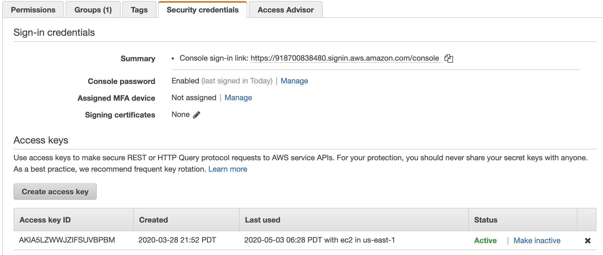

# AWS Cli Setup
> Make sure you complete the CLI setup - [instructions](/aws-cli-setup).

> Download AWS CLI
Follow [instructions](https://docs.aws.amazon.com/cli/latest/userguide/cli-chap-install.html) to download AWS CLI utility.

> Create Access credentials
1. Go to https://console.aws.amazon.com/iam/home?region=us-east-1#/users
2. Select your user that want to login as from CLI.
3. Click "Security Credentials" tab
4. Click "Create access key" button

5. You should see a popup. Make sure you save this infromation locally **as the secret info won't show up again**.


> Configure CLI using the credentials generated above. Open a terminal (Mac / Linux) or command line (windows) and enter the following command. The command line interface (CLI) interactively asks for Access ket, secret and the region. 
```
aws configure
```

| Region                     | Region Code    | 
|----------------------------|----------------| 
| Region Name Code           |                | 
| US East (Ohio)             | us-east-2      | 
| US East (N. Virginia)      | us-east-1      | 
| US West (N. California)    | us-west-1      | 
| US West (Oregon)           | us-west-2      | 
| Africa (Cape Town)         | af-south-1     | 
| Asia Pacific (Hong Kong)   | ap-east-1      | 
| Asia Pacific (Mumbai)      | ap-south-1     | 
| Asia Pacific (Osaka-Local) | ap-northeast-3 | 
| Asia Pacific (Seoul)       | ap-northeast-2 | 
| Asia Pacific (Singapore)   | ap-southeast-1 | 
| Asia Pacific (Sydney)      | ap-southeast-2 | 
| Asia Pacific (Tokyo)       | ap-northeast-1 | 
| Canada (Central)           | ca-central-1   | 
| China (Beijing)            | cn-north-1     | 
| China (Ningxia)            | cn-northwest-1 | 
| Europe (Frankfurt)         | eu-central-1   | 
| Europe (Ireland)           | eu-west-1      | 
| Europe (London)            | eu-west-2      | 
| Europe (Milan)             | eu-south-1     | 
| Europe (Paris)             | eu-west-3      | 
| Europe (Stockholm)         | eu-north-1     | 
| Middle East (Bahrain)      | me-south-1     | 
| South America (São Paulo)  | sa-east-1      | 


