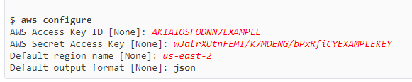

# Create a web application


> Download AWS CLI
```


```


> Create Access credentials
```

```

> Configure CLI
```
aws configure
```


> Run the following command to create an EC2 machine
```

```

> 
```
aws ec2 describe-regions --output table
```

