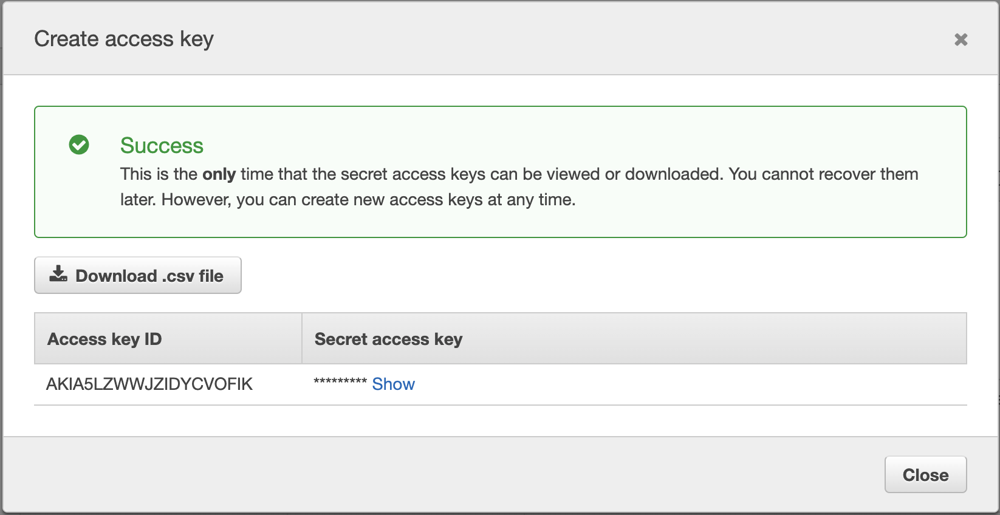

# Create a web application


> Download AWS CLI
```


```


> Create Access credentials
1. Go to https://console.aws.amazon.com/iam/home?region=us-east-1#/users
2. Select your user that want to login as from CLI.
3. Click "Credentials" tab
4. Click "Create Access Key" button

5. You should see a popup. Make sure you save this infromation locally **as the secret info won't show up again**.

```

```

> Configure CLI
```
aws configure
```


> Run the following command to create an EC2 machine
```

```

> 
```
aws ec2 describe-regions --output table
```

